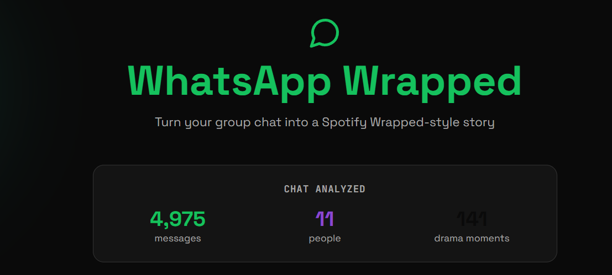
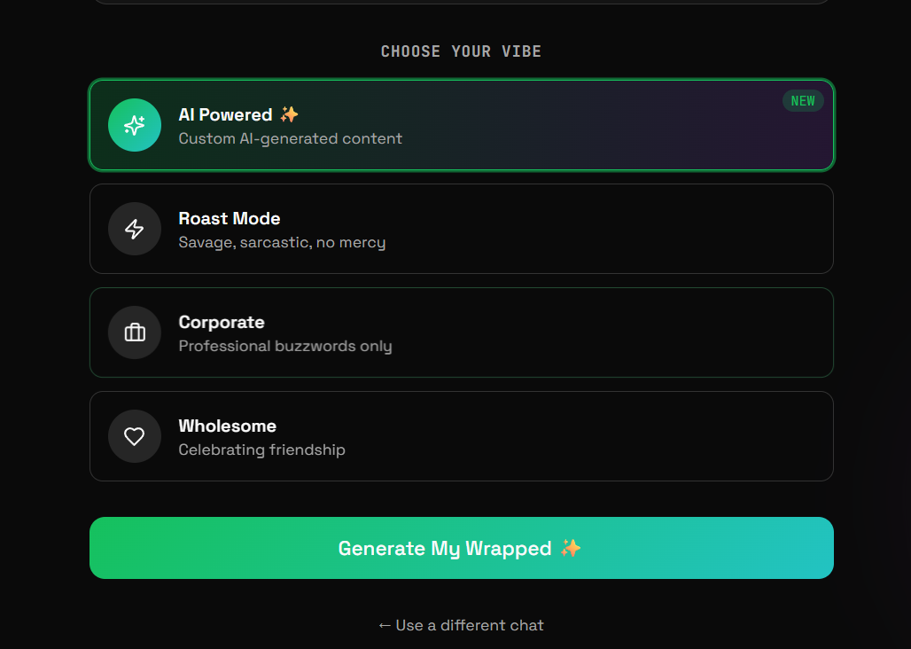
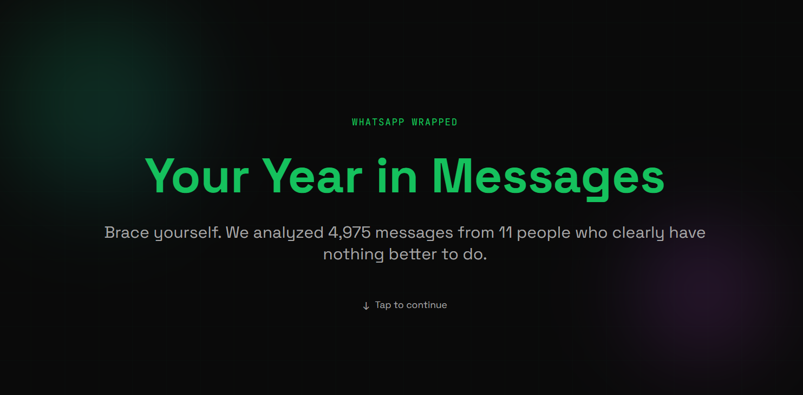
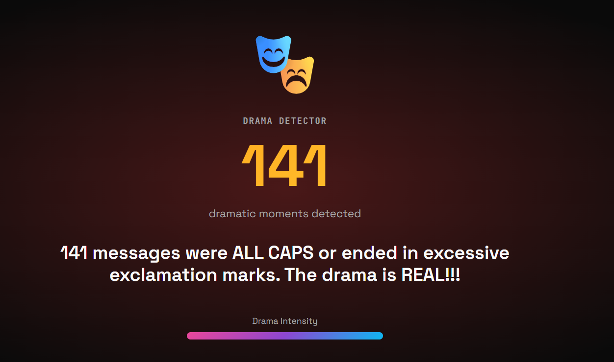
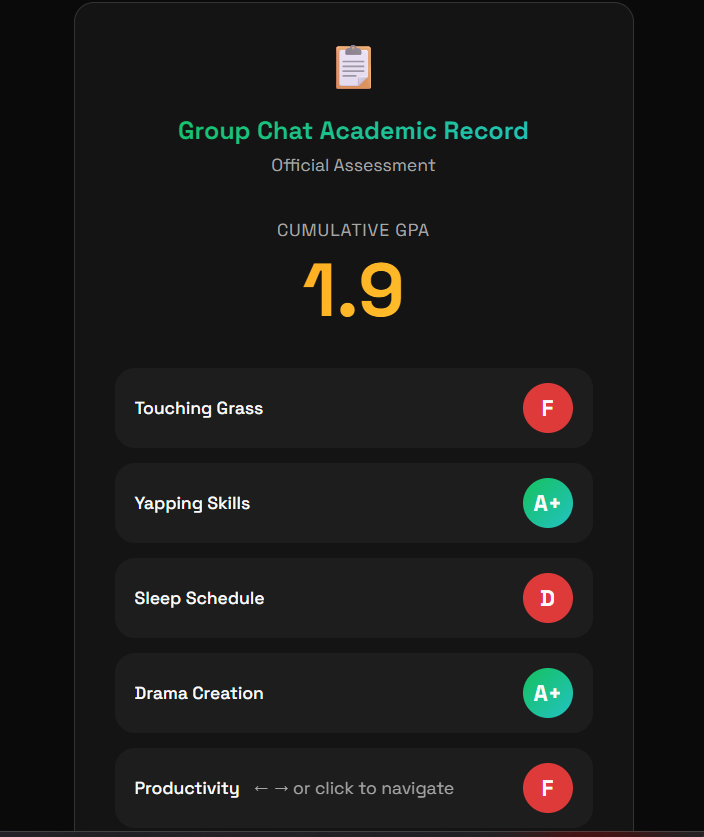

# WhatsWrapped 💬📊

Transform your WhatsApp conversations into beautiful, shareable wrapped stories—just like Spotify Wrapped, but for your chats!

**🚀 [Live Demo](https://whatwrapped.vercel.app)**

## Overview

WhatsWrapped is an interactive web application that analyzes WhatsApp group chat exports and generates personalized, Spotify Wrapped-style stories. Upload your chat transcript, choose your preferred narrative style, and watch as your chat moments come to life through custom-generated slides.

### Key Features

✨ **Multiple Narrative Styles**
- **AI Powered** - Intelligent, context-aware content generated from your actual chat data
- **Roast Mode** - Savage and sarcastic takes on your chat dynamics
- **Corporate** - Professional buzzword-heavy commentary
- **Wholesome** - Celebrating friendship and group achievements

📱 **Interactive Story Viewer**
- Smooth animations and transitions between slides
- Beautiful UI with Tailwind CSS styling
- Export-ready design for sharing on social media

🔒 **Privacy First**
- All chat data stays on your device
- No uploads to external servers (except when using AI mode with Gemini API)
- Transparent about data handling

📊 **Comprehensive Analytics**
- Identify the biggest yappers and ghost members
- Analyze peak chaos days and drama moments
- Track night owl behavior and emoji signatures
- Group statistics and user breakdowns

## 📸 Gallery

### Demo Screens

<div style="display: grid; grid-template-columns: repeat(auto-fit, minmax(250px, 1fr)); gap: 20px; margin: 20px 0;">
  






</div>

## 🛠️ Tech Stack

- **Frontend Framework**: React 18 with TypeScript
- **Build Tool**: Vite 5
- **Styling**: Tailwind CSS + Shadcn/UI Components
- **State Management**: React Hooks + Context API
- **Charts**: Recharts
- **Animations**: Framer Motion
- **Backend**: Supabase Edge Functions
- **Deployment**: Vercel

## 🚀 Quick Start

### Prerequisites
- Node.js (v18 or higher)
- npm or bun

### Installation

```bash
# Clone the repository
git clone https://github.com/bitWise72/whatsWrapped.git
cd whatsWrapped

# Install dependencies
npm install

# Start the development server
npm run dev
```

The application will be available at `http://localhost:8080`

### Building for Production

```bash
# Build the project
npm run build

# Preview the production build
npm run preview
```

## 📋 How to Use

1. **Export Your Chat**: Open WhatsApp, select a group chat, and export it as a text file
   - On Android: Group menu → More → Export chat
   - On iPhone: Swipe left on chat → More → Export Chat

2. **Upload the File**: Drag and drop or click to upload your chat export file

3. **Choose Your Style**: Select one of the four narrative styles:
   - AI Powered (requires API key)
   - Roast Mode
   - Corporate
   - Wholesome

4. **Enjoy Your Story**: Watch your personalized wrapped story unfold with beautiful animations

5. **Share**: Download and share your favorite slides on social media

## 🔄 Project Structure

```
whatsWrapped/
├── src/
│   ├── components/          # React components
│   │   ├── slides/         # Individual story slide components
│   │   ├── ui/             # Reusable UI components (Shadcn)
│   │   ├── StoryViewer.tsx # Main story viewer component
│   │   └── NavLink.tsx      # Navigation component
│   ├── pages/              # Page components
│   │   ├── Index.tsx       # Main upload and configuration page
│   │   └── NotFound.tsx    # 404 page
│   ├── lib/                # Utility functions
│   │   ├── parser.ts       # WhatsApp chat parser
│   │   ├── analytics.ts    # Chat analytics generator
│   │   ├── templates.ts    # Narrative templates
│   │   └── types.ts        # TypeScript type definitions
│   ├── hooks/              # Custom React hooks
│   ├── integrations/       # External service integrations
│   │   └── supabase/       # Supabase client setup
│   └── main.tsx            # Application entry point
├── supabase/
│   └── functions/
│       └── generate-wrapped/ # Edge function for AI content generation
├── public/                 # Static assets and demo screenshots
├── vite.config.ts          # Vite configuration
├── tailwind.config.ts      # Tailwind CSS configuration
└── tsconfig.json           # TypeScript configuration
```

## 📊 Chat Analysis

WhatsWrapped analyzes your chat data to extract:

- **Message Statistics**: Total messages, messages per user, average message length
- **User Behavior**: Yap index (how much someone talks), emoji usage, caps lock ratio
- **Temporal Patterns**: Busiest hours, night owl members, most chaotic days
- **Content Analysis**: Most discussed topics, common phrases, conversation patterns
- **Group Dynamics**: Member interactions, drama moments, group mood

## 🔐 Privacy & Security

- **Local Processing**: Chat files are processed entirely in your browser
- **No Cloud Storage**: Your chat data is never stored on our servers
- **AI Mode Exception**: When using AI-powered mode, chat context is sent to Gemini API
- **Transparent**: Users are explicitly informed about data handling

## 🚀 Deployment

This project is deployed on [Vercel](https://vercel.com) and can be accessed at https://whatwrapped.vercel.app

### Deploy Your Own Instance

#### Using Vercel CLI

```bash
# Install Vercel CLI globally
npm install -g vercel

# Navigate to project directory
cd whatsWrapped

# Deploy to production
vercel --prod
```

#### Using Vercel Dashboard

1. Push your code to GitHub
2. Go to [Vercel Dashboard](https://vercel.app)
3. Click "New Project"
4. Import your GitHub repository
5. Configure environment variables
6. Deploy

## 🔑 Environment Variables

Create a `.env` file in the root directory (for local development):

```env
VITE_SUPABASE_PROJECT_ID=your_project_id
VITE_SUPABASE_PUBLISHABLE_KEY=your_publishable_key
VITE_SUPABASE_URL=your_supabase_url
```

For AI-powered features, you'll need:
- Gemini API key (for AI content generation)
- Supabase project with configured Edge Functions

## 📝 Slide Types

### Intro Slide
Introduces the group with personalized context about their communication style

### Yapper Slide
Highlights the member who sent the most messages with witty commentary

### Timeline Slide
Celebrates the group's most chaotic day with context-aware descriptions

### Night Owl Slide
Identifies and roasts the members who chat at ungodly hours

### Drama Slide
Counts the dramatic moments (ALL CAPS messages) and their triggers

### Roast Slide
A humorous, personalized roast of the entire group based on their behavior

### Report Card
A fun "school report card" grading the group on various metrics with a principal's note

## 🐛 Troubleshooting

### Chat File Not Recognized
- Ensure you exported the chat from WhatsApp (not a screenshot or other format)
- Try exporting without media files for faster processing

### AI Generation Failing
- Check if your API key is properly configured
- Ensure you have sufficient credits with the AI service
- The app will fall back to template-based content if AI fails

### Slow Performance
- Large chat exports (10,000+ messages) may take longer to process
- Try with a smaller subset of your chat history

## 🤝 Contributing

Contributions are welcome! Feel free to submit issues or pull requests.

## 📄 License

This project is open source and available under the MIT License.

## 👨‍💻 Author

Built with ❤️ by [Sayan](https://github.com/bitWise72)

## 🙋 Support

If you encounter any issues or have suggestions, please open an issue on [GitHub](https://github.com/bitWise72/whatsWrapped/issues)

---

**Built with Vite • React • TypeScript • Tailwind CSS • Supabase**
